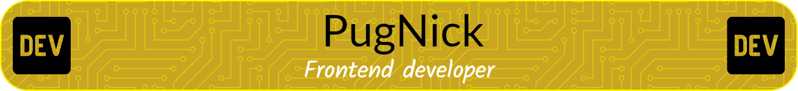

## Hello there 👋
# 

### 👋 Hola, soy Pablo Valdez!

- 🖥️ Frontend Developer apasionado por el diseño de experiencias web.
- 💡 Interesado en mejorar la accesibilidad y el rendimiento en la web.
- 🌟 Objetivo: Aportar soluciones creativas y eficientes a proyectos desafiantes.

### 🛠 Skills:

### 🧩 Tecnologías con las que estoy familiarizado

📫 ¡Conecta conmigo!
- LinkedIn: https://www.linkedin.com/in/pablo-valdez-720439276/?trk=opento_sprofile_details(#)
- Portafolio: [en proceso](#)

<!--
**PugNick/PugNick** is a ✨ _special_ ✨ repository because its `README.md` (this file) appears on your GitHub profile.

Here are some ideas to get you started:

- 🔭 I’m currently working on ...
- 🌱 I’m currently learning ...
- 👯 I’m looking to collaborate on ...
- 🤔 I’m looking for help with ...
- 💬 Ask me about ...
- 📫 How to reach me: ...
- 😄 Pronouns: ...
- ⚡ Fun fact: ...
-->
